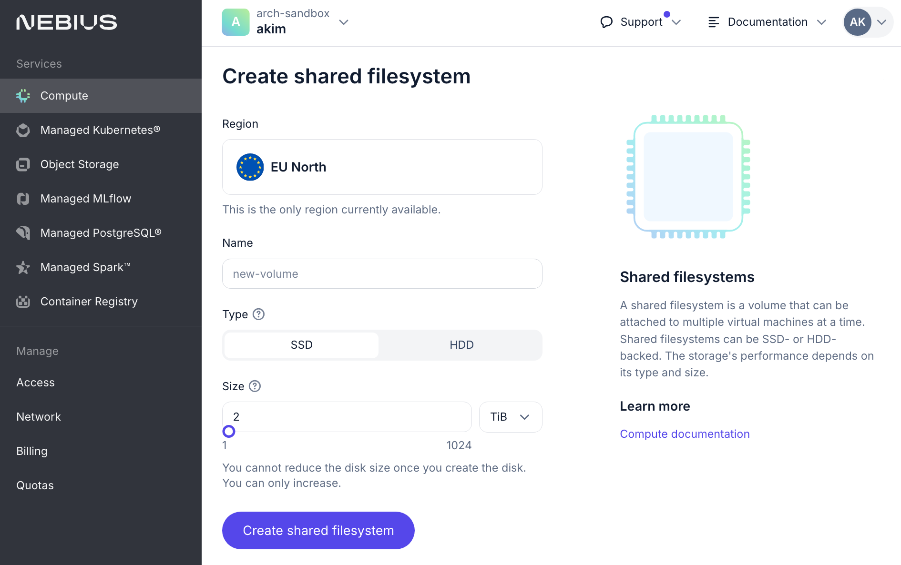
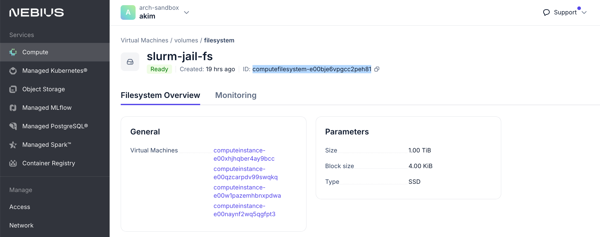

# Slurm on Kubernetes with Soperator - Installation Guide

Welcome! This guide will help you set up a Slurm cluster running on Kubernetes using Nebius Cloud.
The entire setup process is automated with Terraform, allowing you to deploy your cluster with a single command.

## Why Run Slurm on Kubernetes?

Our solution offers several key benefits:

- **Effortless Scaling**: Add or remove nodes instantly without manual bootstrapping
- **Built-in High Availability**: Automatic pod restarts and self-healing capabilities
- **Unified Storage**: Shared root filesystem across all nodes - no more version sync headaches
- **Enhanced Security**: Isolated environments prevent accidental system breakage
- **Automated GPU Health Checks**: Regular NCCL tests ensure optimal GPU performance

## Prerequisites

Before starting, ensure you have these tools installed:

- [Terraform](https://developer.hashicorp.com/terraform/tutorials/aws-get-started/install-cli)
- [Nebius CLI ](https://nebius.com/docs/cli/quickstart)
- [kubectl](https://kubernetes.io/docs/tasks/tools/)
- [jq](https://jqlang.github.io/jq/download/)
- coreutils: 
  - macOS: `brew install coreutils`
  - Ubuntu: `sudo apt-get install coreutils`

## Installation Steps

### 1. Get Terraform Files

The recommended way: download and unpack [the lastest release](https://github.com/nebius/nebius-solution-library/releases):
```bash
tar -xvf soperator-tf-*.**.**-*.tar.gz
```

An alternative way: checkout a release git tag:
```bash
git fetch --all --tags && git checkout tags/soperator-[VERSION]
```

### 2. Create Your Installation Directory

Assuming you are in the repository root or unpacked directory.

```bash
cd soperator # This file directory.
export INSTALLATION_NAME=<your-name> # e.g. company name
mkdir -p installations/$INSTALLATION_NAME
cd installations/$INSTALLATION_NAME
cp -r ../example/ ./
```

### 3. Set Up Your Environment

Set your `NEBIUS_TENANT_ID` and `NEBIUS_PROJECT_ID` in the `.envrc` file, then run:

```bash
source .envrc
```

This command loads environment variables and performs several important setup tasks:
- Authenticates with Nebius CLI and exports IAM token
- Creates/retrieves service account for Terraform
- Configures Object Storage access for the Terraform state
- Exports environment variables with resource IDs 

Check that NEBIUS_IAM_TOKEN is valid:
```bash
nebius iam whoami
```

### 4. (Optional) Create Storage Infrastructure

Create a "[jail](https://en.wikipedia.org/wiki/FreeBSD_jail)" filesystem in the Nebius Console.

This step is required for those who wants to persist their jail data after the cluster deletion.
You can offload storage creation to the Terraform script instead, but it will be deleted with the cluster in this case.




> [!NOTE] 
> - For storage > 2 TiB: Contact Nebius Support (in the web console) to enable multitablet functionality
> - Note down the filesystem ID for your terraform configuration
> 

### 5. Configure Your Cluster

Edit `terraform.tfvars` with your requirements:

```hcl
# Name of the company. It is used for context name of the cluster in .kubeconfig file.
company_name = "<YOUR-COMPANY-NAME>"

# ...

# Use your manually created jail filesystem
filestore_jail = {
  existing = {
    id = "computefilesystem-<YOUR-FILESYSTEM-ID>"
  }
}

# ...

# Configuration of Slurm Worker node sets.
slurm_nodeset_workers = [{
  size                    = <TOTAL_NODES_NUMBER> # Must be divisible by nodes_per_nodegroup. Recommended value for soperator development is 2.   
  nodes_per_nodegroup     = <NUMBER_OF_NODES_PER_NODEGROUP> # Recommended value for soperator development is 1.
  max_unavailable_percent = 50
  resource = {
    platform = "gpu-h100-sxm" # For a CPU-only cluster, see https://docs.nebius.com/compute/virtual-machines/types.
    preset   = "8gpu-128vcpu-1600gb"
  }
  boot_disk = {
    type                 = "NETWORK_SSD"
    size_gibibytes       = 2048
    block_size_kibibytes = 4
  }
  gpu_cluster = {
    infiniband_fabric = "" # Contact support for the correct value.
  }
}]

# Add your SSH public key here to connect to the Slurm cluster. 
slurm_login_ssh_root_public_keys = [
  "ssh-rsa AAAAB3N... your-key"
]
```

`k8s_cluster_node_ssh_access_users` is for connecting to the K8S cluster itself.
You probably don't need this unless you want to manage the K8S cluster manually.


> [!NOTE] 
> - For large clusters: Use larger presets for CPU-only nodes
> - Adjust storage sizes based on your needs
> - Contact support to increase quotas if needed
> - Ensure SSH keys are added to the correct location

### 6. Deploy Your Cluster

#### 6.a. (Optional) Set Up Terraform Workspace

This is a required step for the Nebius Soperator dev team.
If you don't need to handle several installations in one Object Storage bucket for the terraform state, you can skip it.

```bash
terraform workspace new <MY-CLUSTER-NAME>
```

#### 6.b. Init terraform

```bash
terraform init
```

#### 6.c. (Optional) Create a K8S Cluster separately

```bash
terraform apply -target module.k8s
```

This will take ~20 min for a small GPU cluster.

#### 6.d. Deploy the Slurm Cluster

```bash
terraform apply
```

This will take ~15 min in addition to the K8S cluster creation time.

### 7. (Optional) Verify Kubernetes Setup
- List kubectl contexts to verify that the new cluster was added
```bash
kubectl config get-contexts
```

The new context should be named `nebius-<your-company-name>-slurm`.

- Set the new context if it is not the current one
```bash
kubectl config use-context nebius-<your-company-name>-slurm
```

- Verify that you can list the pods in the cluster and there are no pods in the error state
```bash
kubectl get pods --all-namespaces
```

- Verify all resources show green status in the console

### 8. Get Cluster Connection Details

Get the Slurm cluster IP address
```bash
export SLURM_IP=$(terraform state show module.login_script.terraform_data.lb_service_ip | grep 'input' | grep -oE '[0-9]+\.[0-9]+\.[0-9]+\.[0-9]+' | head -n 1)
ssh root@$SLURM_IP -i ~/.ssh/<private_key>
```

or connect using the login script:

```bash
./login.sh -k ~/.ssh/<private_key>
```


## (Optional) Test Your Installation

Copy the test files to the Slurm cluster:
```bash
cd soperator/test
scp -i ~/.ssh/<private-key> -r ./quickcheck root@"$SLURM_IP":/
```

Connect to the Slurm cluster and run the tests:

```bash
ssh root@$SLURM_IP
cd /quickcheck
# Basic Slurm test
sbatch hello.sh
tail -f results/hello.out    
# GPU interconnect test
sbatch nccl.sh
tail -f results/nccl.out
# Container test
sbatch enroot.sh
tail -f results/enroot.out
```
