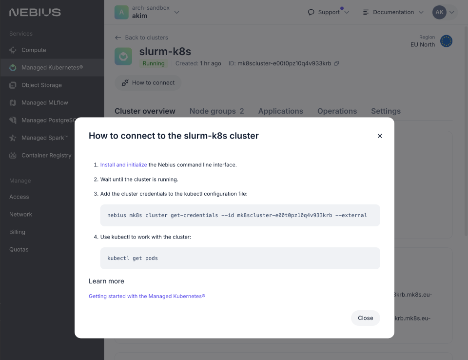

# Slurm on Kubernetes with Soperator - Installation Guide

Welcome! This guide will help you set up a Slurm cluster running on Kubernetes using Nebius Cloud. The entire setup process is automated with Terraform, allowing you to deploy your cluster with a single command.

## Why Run Slurm on Kubernetes?

Our solution offers several key benefits:

- **Effortless Scaling**: Add or remove nodes instantly without manual bootstrapping
- **Built-in High Availability**: Automatic pod restarts and self-healing capabilities
- **Unified Storage**: Shared root filesystem across all nodes - no more version sync headaches
- **Enhanced Security**: Isolated environments prevent accidental system breakage
- **Automated GPU Health Checks**: Regular NCCL tests ensure optimal GPU performance

## Prerequisites

Before starting, ensure you have these tools installed:

- [Terraform](https://developer.hashicorp.com/terraform/tutorials/aws-get-started/install-cli)
- [Nebius CLI ](https://nebius.com/docs/cli/quickstart)
- [kubectl](https://kubernetes.io/docs/tasks/tools/)
- AWS CLI: `python -m pip install awscli`
- [jq](https://jqlang.github.io/jq/download/)
- coreutils: 
  - macOS: `brew install coreutils`
  - Ubuntu: `sudo apt-get install coreutils`


## Installation Steps

1. **Create Your Installation Directory**
```bash
mkdir -p installations/<your-name>
cd installations/<your-name>
cp -r ../example/ ./
```

2. **Set Up Your Environment**
```bash
# Set your Nebius project details
export NEBIUS_TENANT_ID='<your-tenant-id>'
export NEBIUS_PROJECT_ID='<your-project-id>'

# Load environment variables 
source .envrc
```

This command loads environment variables and performs several important setup tasks:
- Authenticates with Nebius CLI and exports IAM token
- Creates/retrieves service account for Terraform
- Configures Object Storage access
- Exports necessary resource IDs


3. **Create Storage Infrastructure**

Create a "[jail](https://en.wikipedia.org/wiki/FreeBSD_jail)" filesystem in the Nebius Console.


> **Important Storage Notes:**
> - For storage > 2 TiB: Contact Nebius Support (in the web console) to enable multitablet functionality
> - Note down the filesystem ID for your terraform configuration
> 

4. **Configure Your Cluster**

Edit `terraform.tfvars` with your requirements:

```hcl
# Use your manually created jail filesystem
filestore_jail = {
  existing = {
    id = "computefilesystem-<YOUR-FILESYSTEM-ID>"
  }
}

# Configure GPU cluster
k8s_cluster_node_group_gpu = {
  resource = {
    platform = "gpu-h100-sxm"
    preset   = "8gpu-128vcpu-1600gb"
  }
  gpu_cluster = {
    infiniband_fabric = "fabric-3"
  }
}

# Add your SSH public key here to connect to the Slurm cluster 
slurm_login_ssh_root_public_keys = [
  "ssh-rsa AAAAB3N... your-key"
]
```

`k8s_cluster_node_ssh_access_users` is for connecting to the K8S cluster itself.
You probably don't need this unless you want to manage the K8S cluster manually.


> **Important Configuration Notes:**
> - For large clusters: Use larger presets for CPU-only nodes
> - Adjust storage sizes based on your needs
> - Contact support to increase quotas if needed
> - Ensure SSH keys are added to the correct location

5. **Deploy Your Cluster**
```bash
terraform init
terraform apply # This will take ~15-20 mins
```

6. **(Optionally) Verify Kubernetes Setup**
- Open the K8s cluster page in Nebius Console
- Find and copy the command under "How to connect"

- Execute this command to connect to your cluster

```bash
nebius mk8s cluster get-credentials --id mk8scluster-<...> --external
```
- Verify that you can list the pods in the cluster and there are no pods in the error state

```bash
kubectl get pods --all-namespaces
```

- Verify all resources show green status in the console

7. **Get Cluster Connection Details**

Get the Slurm cluster IP address
```bash
export SLURM_IP=$(terraform state show module.login_script.terraform_data.connection_ip | grep 'input' | grep -oE '[0-9]+\.[0-9]+\.[0-9]+\.[0-9]+' | head -n 1
)
ssh root@$SLURM_IP
```

or connect using the login script:

```bash
./login.sh -k ~/.ssh/id_rsa
```


## (Optional) Test Your Installation

Copy the test files to the Slurm cluster:
```bash
cd soperator/test
./prepare_for_quickcheck.sh -u root -k ~/.ssh/<private_id_rsa_key> -a $SLURM_IP
```

Connect to the Slurm cluster and run the tests:

```bash
ssh root@$SLURM_IP
cd /quickcheck
# Basic Slurm test
sbatch hello.sh
tail -f outputs/hello.out    
# GPU interconnect test
sbatch nccl.sh
tail -f outputs/nccl.out
# Container test
sbatch enroot.sh
tail -f outputs/enroot.out
```